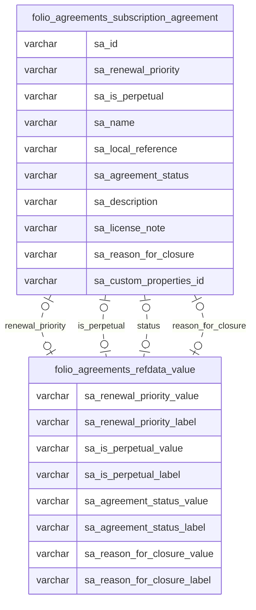

## Test for Mermaid

```mermaid
erDiagram
  folio_agreements_subscription_agreement |o..o| folio_agreements_refdata_value : "renewal_priority"
  folio_agreements_subscription_agreement |o..o| folio_agreements_refdata_value : "is_perpetual"
  folio_agreements_subscription_agreement |o..o| folio_agreements_refdata_value : "status"
  folio_agreements_subscription_agreement |o..o| folio_agreements_refdata_value : "reason_for_closure"
    folio_agreements_subscription_agreement {
      varchar sa_id
      varchar sa_renewal_priority
      varchar sa_is_perpetual
      varchar sa_name
      varchar sa_local_reference
      varchar sa_agreement_status
      varchar sa_description
      varchar sa_license_note
      varchar sa_reason_for_closure
      varchar sa_custom_properties_id
    }
    folio_agreements_refdata_value {
      varchar sa_renewal_priority_value
      varchar sa_renewal_priority_label
      varchar sa_is_perpetual_value
      varchar sa_is_perpetual_label
      varchar sa_agreement_status_value
      varchar sa_agreement_status_label
      varchar sa_reason_for_closure_value
      varchar sa_reason_for_closure_label
    }
```
